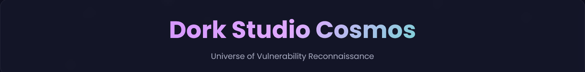
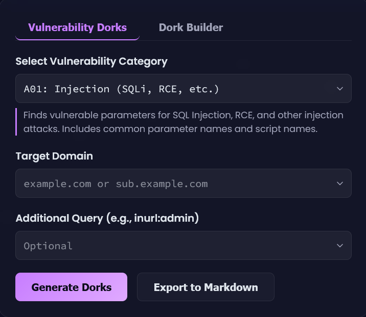

# 🚀 Dork Studio Cosmos — *Universe of Vulnerability Reconnaissance*

### ✨ **Created by *Divu*** — Bug hunter · Recon artist · GitHub: [Divakar2006](https://github.com/Divakar2006)

> A beautiful, client-side Google Dork generator and recon workbench for bug hunters and security researchers. Built with pure HTML / CSS / JavaScript — no backend required.

---

## 📸 Demo 




---

## 🔥 Highlights

* 30+ curated Google Dork categories for common vulnerabilities (SQLi, XSS, SSRF, LFI/RFI, sensitive files, backups, etc.)
* Visual **Dork Builder** for crafting custom queries (`inurl:`, `filetype:`, `intitle:`, ...)
* Instant **Search on Google**, **Copy Dork**, **Favorite**, and **Export to Markdown**
* Persistent **Favorites** and **Search History** via `localStorage`
* Stunning, dark, cosmic UI — designed for focused recon sessions

*Source: main app source `dork-studio-cosmos.html`*. 

---

## 📂 Repository files

* `dork-studio-cosmos.html` — Main application (UI + logic). 
* `images/dork-1.png` — Header screenshot (optional).
* `images/dork-2-use.png` — UI screenshot (optional).
* `README.md` — This file.

---

## ⚡ Quick Start — Run (no install)

1. Clone the repo:

   ```bash
   git clone https://github.com/Divakar2006/dork-studio-cosmos.git
   cd dork-studio-cosmos
   ```

2. Open the tool:

   * Double-click `dork-studio-cosmos.html` or open it in your browser via **File → Open File**.

3. Use it:

   * Choose a **Vulnerability Category** or switch to **Dork Builder**.
   * Optionally add **Target Domain** and **Additional Query**.
   * Click **Generate Dorks** → results appear in the right panel.
   * Use buttons to **Search**, **Copy**, or **⭐ Favorite** a dork.
   * Click **Export to Markdown** to download generated dorks.

---

## 🛠 Development / Live Server (optional)

For live reload while editing:

* VS Code Live Server (open folder → *Go Live*)
* Or with Node:

```bash
npm install -g http-server
http-server -c-1
# Open http://127.0.0.1:8080/dork-studio-cosmos.html
```

---

## 📣  Click here for Direct access
Direct link to the hosted version: (live)

```
https://Divakar2006.github.io/dork-studio-cosmos/
```

---

## ⚖️ Security & Legal — Read Before Using

**Only** run recon on targets you own or have explicit permission to test. Google Dorking can surface sensitive information — do not access, download, or exfiltrate data you are not authorized to. Follow the target’s bug bounty rules and applicable laws. Misuse of this project is the user’s responsibility.

---

## 👤 Author

**Divu** (Divakar) — bug hunter & recon enthusiast
GitHub: [https://github.com/Divakar2006](https://github.com/Divakar2006)

---

